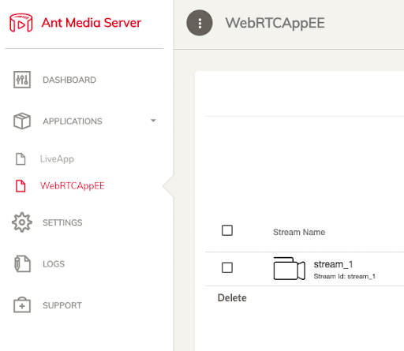
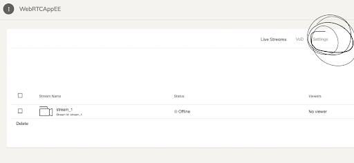
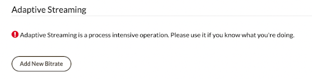
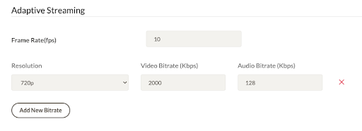
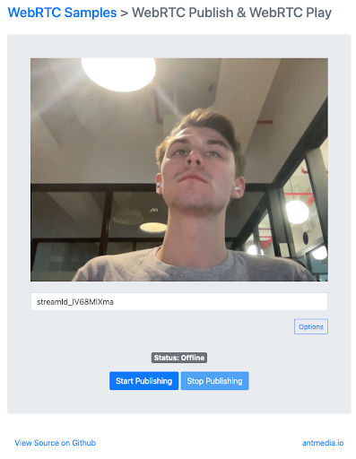
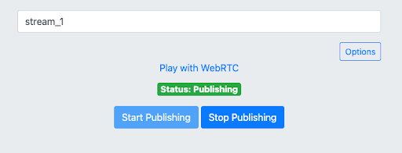

# AntMediaInferencePlugin

This is a plugin that enables Ant Media servers to stream frames to DirectAI's object detection inference pipeline. Your object detection model(s) are defined entirely in text via a JSON. No training required.

## Prerequisites
- You’ll need access to DirectAI Credentials. These are generated by navigating to [DirectAi’s landing page](https://directai.io) and clicking the “Get API Access” button. Click “Get New Credentials” after the signup/login flow to grab your client_id & client_secret.
- You’ll need Dashboard AND SSH access to a **development Ant Media Server**. The plugin installation process initiates a restart of the Ant Media Server. That server should be running Ant Media Server Enterprise Edition v2.7.0 or above. Here's a [quickstart guide](https://www.youtube.com/watch?v=EH6v-yUyzjU) for getting one running on AWS.

## Configuring the Ant Media Server
- We'll need to modify settings in your Ant Media Dashboard to get started.
  - Choose your webrtc streaming application. For testing purposes, we’ll use **WebRTCAppEE**.
  <br>
  - Select the settings for this application.
  <br>
  - Enable Adaptive Bit Rate (see Before and After). This allows for ease of stream decomposition into individual frames.
    - Before:<br>
    <br>
    - After:<br>
    <br>
  - Enable the IP Filter for RESTful API and add `127.0.0.1`. You'll be making curl requests to the local Ant Media Server.<br>
  <br>

## Installing the Plugin
- Clone this repository into the root directory of your Ant Media Server.
- Install Java-related packages: `sudo apt update && sudo apt install maven openjdk-11-jdk`.
- Build and Install the DirectAI plugin from inside the `AntMediaInferencePlugin` directory. **DANGEROUS**: This will **restart** the Ant Media server: `./redeploy.sh`
  - Note: The DirectAI plugin installation process also includes an installation of OpenCV 4.7.0 

## Getting Started on Inference:
- Take a look at the trailing logs of the Ant Media Server. This will show us when the DirectAI object detector starts logging information.
`tail -f /usr/local/antmedia/log/ant-media-server.log`
- Run `cp AntMediaInferencePlugin/params.json.template AntMediaInferencePlugin/params.json`. Open up the latter file in a text editor.
  - Copy in your DirectAI Credentials to the values of `directaiClientID` and `directaiClientSecret`.
  - Define the `clientWebhook` value with a webhook endpoint of your choice. Detection results will be dumped to this endpoint where you’ll be able to process them on your own.
  - Optional: If you want to copy individual frames to S3 while we perform inference, follow the [S3 Credentials Generation Instructions here](https://docs.google.com/document/d/17lf6Hu3_8cGJ5zfrYGxjuypSdcr_dpM9kcsk6L2Wats/edit?usp=sharing). You’ll need to programmatically populate `s3Bucket`, `s3AccessKey`, and `s3SecretKey` with temporary S3 Write Credentials. You'll also need to set `downloadFramesToS3` to `true`.
- From the Ant Media Server, start a sample WebRTC Stream. Take note of the stream ID (e.g. “stream_1”)
  - The sample stream builder should be available from https://AMS_IP/WebRTCAppEE
  - Before Starting:<br>
  <br>
  - After Starting:<br>
  <br>
- Start the object detection process on an Ant Media Stream from the Ant Media Server:
```
curl --location --request POST 'http://localhost:5080/{appName}/rest/v2/inference/{STREAM_ID}/start' \
  --header 'Accept: Application/json' \
  --header 'Content-Type: application/json' \
  -d @params.json
```
- When you're ready to stop the object detection process on the Ant Media Stream:
```
curl --location --request POST 'http://localhost:5080/{appName}/rest/v2/inference/{STREAM_ID}/stop' \
  --header 'Accept: Application/json' \
  --header 'Content-Type: application/json'
```

## More Context on Inference Parameters:
- The `clientWebhook` allows you to pick a place where all that object detection information should be dumped. You can make use of it as necessary on the server that hosts that webhook.
- Models are defined inside `model_config`.
  - Unique object detectors are stored as items in the `detectors` list. 
  - `name` describes the label of that object detector, not the function. 
  - We use `examples_to_include` and `examples_to_exclude` to describe what the object detector should and should not identify. Building the model is really just about describing it in plain language.
  - The `detection_threshold` parameter define minimum bound for identifying candidate objects in individual frames. We recommend modifying the inclusion/exclusion lists before attempting to change the numerical threshold. Come chat with us in [Discord](https://discord.com/invite/APU6MWBKQv) or send us an email (ben@directai.io) if you're having trouble!


